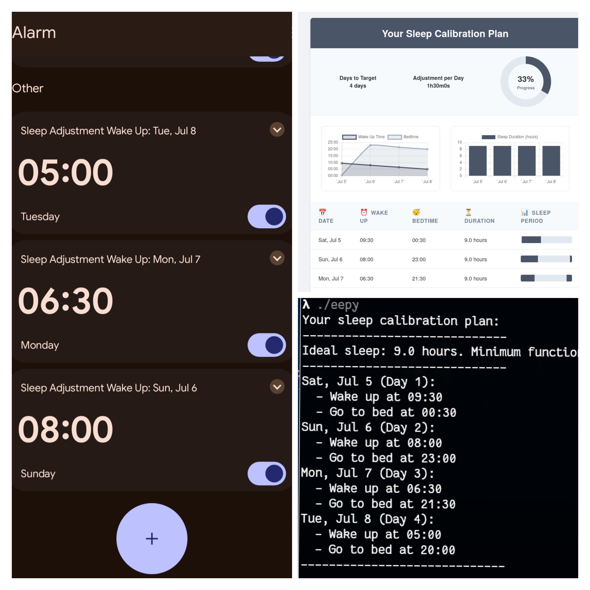

<!--
SPDX-FileCopyrightText: 2025 Christina Sørensen

SPDX-License-Identifier: EUPL-1.2
-->

<div align="center">

# eepy



</div>

`eepy` is a simple command-line tool to help you calibrate your sleep schedule.

It generates a day-by-day plan to gradually adjust your wake-up time to meet your target, ensuring you get an ideal amount of sleep each night.

## Usage

```bash
eepy [your-current-wake-time] [flags]
```

### Arguments

-   `your-current-wake-time`: Your current wake-up time in HH:MM format.

### Flags

-   `--target`: Your target wake-up time in HH:MM format (default: "05:00").
-   `--adjustment`: The amount of time to adjust your wake-up time by each day (default: "1h30m").
-   `--start-date`: The start date of the plan in YYYY-MM-DD format (default: today).
-   `--html`: Generate an HTML visualization of the plan.

## Example

If you currently wake up at 10:00 and want to start waking up at 05:00, you can run:

```bash
eepy 10:00 --target 05:00 --start-date 2025-07-13
```

`eepy` will then print a plan for you to follow, starting on July 13, 2025.

## HTML Output

When you run `eepy` with the `--html` flag, it will generate an HTML file containing a visual representation of your sleep plan. This file is saved to a temporary directory and the path to the file is printed to the console.

## Plan Persistence

`eepy` automatically saves your generated sleep plan. If a plan already exists for the specified start date, `eepy` will load the existing plan instead of generating a new one. This ensures that your progress is not lost.

## Automatic Alarms with ADB

For Android users, `eepy` can automatically set your daily wake-up alarms using the Android Debug Bridge (ADB).

### Flags

-   `--adb`: Enable setting alarms on a connected Android device.
-   `--no-skip-today`: By default, `eepy` will not set an alarm for the first day of the plan (today). Use this flag to set an alarm for the current day.

When you run `eepy` with the `--adb` flag, it will generate the sleep plan and then immediately attempt to set an alarm for each day of the plan (respecting the `--no-skip-today` flag). The alarms are set with a message indicating the date, like "Sleep Adjustment Wake Up: Sun, Jul 6".

For maximum convenience, it is highly recommended to [set up ADB over Wi-Fi](https://developer.android.com/tools/adb#connect-to-a-device-over-wi-fi-android-11+). This allows `eepy` to set your alarms wirelessly without needing a physical connection to your device.

## Installation

You can build `eepy` from source:

```bash
go build
```
